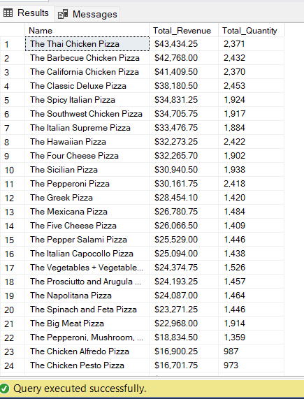
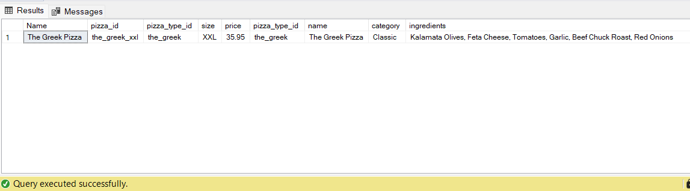
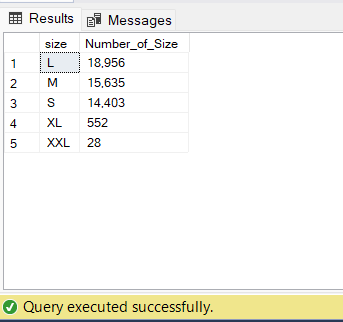
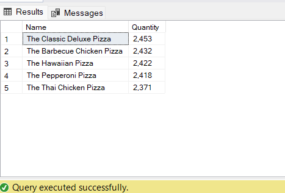
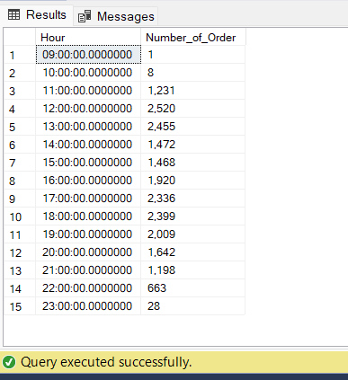
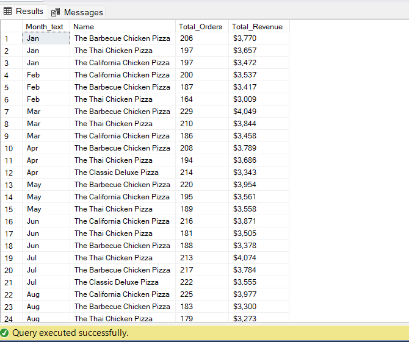
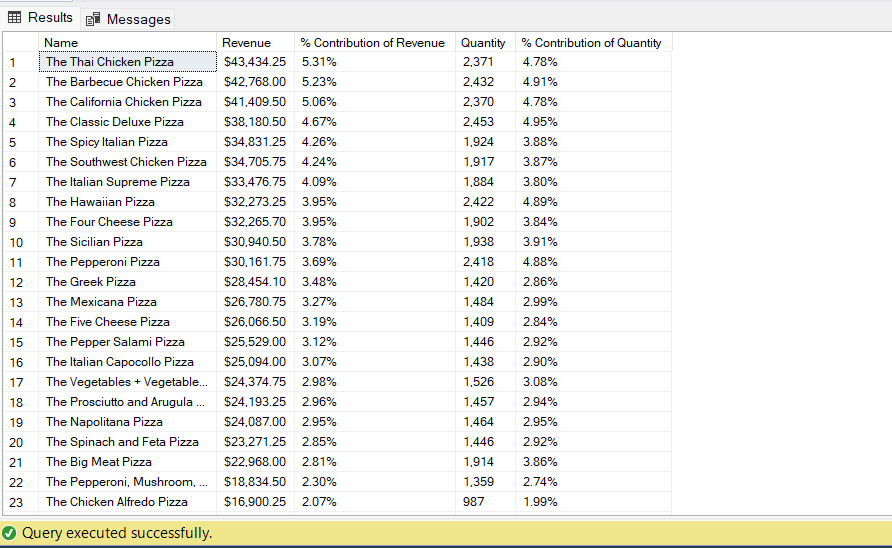
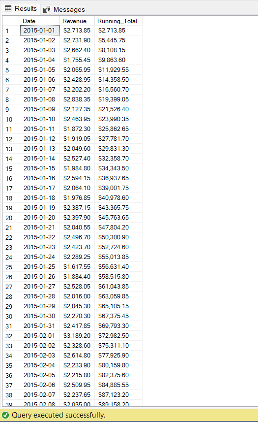
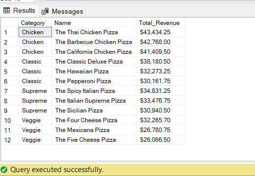

# Pizza-Analysis (Phân tích hoạt động kinh doanh cửa hàng Pizza) 🍕

## Introduction (Giới thiệu) 📚

Mục đích cũng chỉ để phân tích 📊 dữ liệu hoạt động kinh doanh của cửa hàng như doanh số, 💰 doanh thu từ đó dự đoán cũng như đưa ra chiến lược, kế hoạch thu hút khách hàng, 📈 tăng doanh số và lợi nhuận 💵

## Problems (Vấn đề) ⁉️

1. Tính tổng sản lượng, doanh thu bánh Pizza theo loại Pizza.
2. Tìm ra thông tin của loại Pizza có giá cao nhất.
3. Tính tổng số lượng Pizza theo kích thước bánh và sắp xếp theo thứ tự giảm dần.
4. Tìm ra Top 5 loại bánh Pizza có sản lượng bán chạy nhất.
5. Tính tổng lượng đơn Order theo từng cột mốc giờ trong ngày.
6. Tính lượng đơn Order và sản lượng Pizza trung bình trong một ngày.
7. Tìm ra Top 3 loại bánh Pizza được có lượng đơn Order nhiều nhất dựa trên doanh thu theo từng tháng
8. Tính % đóng góp doanh thu và doanh số của từng loại Pizza.
9. Tính doanh thu tích lũy theo thời gian.
10. Tìm ra TOP 5 loại Pizza có đơn Order nhiều nhất dựa trên xếp hạng doanh thu của từng theo doanh mục bánh Pizza.

## Tool I Used (Những công cụ sử dụng) 🛠️

- **SQL Server:** Dùng để truy vấn

- **Power BI:** Để trực quan hóa dữ liệu truy vấn dưới dạng bảng biểu, biểu đồ

- **Github:** Đăng những câu truy vấn, file dữ liệu có liên quan đến bài phân tích, nhằm chia sẻ cho mọi người cùng tham khảo, đánh giá

## The Analysis (Phân tích) 📈

1. Tính tổng sản lượng, doanh thu bánh Pizza theo loại Pizza
```sql
SELECT 
  pty.name Name,
  FORMAT(SUM((Quantity * price)),'C') Total_Revenue,
  FORMAT(SUM(Quantity), 'N0') Total_Quantity
FROM order_details as odt 
JOIN pizzas as piz ON odt.pizza_id = piz.pizza_id
JOIN pizza_types as pty ON pty.pizza_type_id = piz.pizza_type_id
GROUP BY Name
ORDER BY Total_Revenue DESC
```


2. Tìm ra thông tin của loại Pizza có giá cao nhất
```sql
SELECT TOP 1
  Name, *
FROM pizzas as piz
JOIN pizza_types as pit ON piz.pizza_type_id = pit.pizza_type_id
ORDER BY price DESC
```


3. Tính tổng số lượng Pizza theo kích thước bánh và sắp xếp theo thứ tự giảm dần
```sql
SELECT 
  size,
  FORMAT(SUM(quantity),'N0') Number_of_Size
FROM order_details as odt 
JOIN pizzas as piz ON odt.pizza_id = piz.pizza_id
GROUP BY size 
ORDER BY sum(quantity) DESC
```


4. Tìm ra Top 5 loại bánh Pizza có sản lượng bán chạy nhất
```sql
SELECT TOP 5
  Name,
  FORMAT(SUM(quantity),'N0') Quantity
FROM order_details as odt 
JOIN pizzas as piz ON odt.pizza_id = piz.pizza_id 
JOIN pizza_types as pit ON pit.pizza_type_id = piz.pizza_type_id
GROUP BY name
ORDER BY sum(quantity) DESC
```


5. Tính tổng lượng đơn Order theo từng cột mốc giờ trong ngày
```sql
SELECT
  DATETRUNC(HOUR,time) Hour,
  FORMAT(count(order_id),'N0') Number_of_Order 
FROM orders
GROUP BY DATETRUNC(hour,time)
ORDER BY Hour ASC
```


6. Tính lượng đơn Order và sản lượng Pizza trung bình trong một ngày
```sql
SELECT
  CAST(AVG(CAST(total_Quantity as float)) as DECIMAL(5,2)) Avg_Quantity_Per_Day,
  CAST(AVG(CAST(Total_orders as float)) as DECIMAL(5,2)) Avg_Orders_Per_Day
FROM 
  (SELECT 
    Date, SUM(quantity) Total_Quantity,
    COUNT(ord.order_id) Total_orders
  FROM orders as ord
  JOIN order_details as odt ON ord.order_id = odt.order_id
  GROUP BY date) as Test1;
```


7. Tìm ra Top 3 loại bánh Pizza được có lượng đơn Order nhiều nhất dựa trên doanh thu theo từng tháng
```sql
WITH Table1 as
  (SELECT
  	Name, MONTH(ord.Date) Month_Num,
  	FORMAT(ord.date, 'MMM') Month_text,
  	FORMAT(sum((quantity * price)), 'C0') Total_Revenue,
  	FORMAT(COUNT(ord.order_id), 'N0') Total_Orders,
  	RANK() OVER (PARTITION BY MONTH(ord.Date) ORDER BY MONTH(ord.Date) asc, SUM((quantity * price)) DESC) Rank_Number_Orders
  FROM order_details as odt
  JOIN orders as ord ON odt.order_id = ord.order_id
  JOIN pizzas as piz ON odt.pizza_id = piz.pizza_id
  JOIN pizza_types as pit ON piz.pizza_type_id = pit.pizza_type_id
  GROUP BY name, FORMAT(ord.date, 'MMM'), MONTH(ord.Date))
------
SELECT 
  Month_text, Name,
  Total_Orders, Total_Revenue
FROM Table1
WHERE Rank_Number_Orders BETWEEN 1 AND 3
```


8. Tính % đóng góp doanh thu và doanh số của từng loại Pizza
```sql
WITH table1 as 
  (SELECT
      SUM( (quantity * price) ) Total_Revenue,
      SUM( Quantity) Total_quantity
  FROM order_details as odt 
  JOIN pizzas as piz ON odt.pizza_id = piz.pizza_id)
SELECT 
  Name, 
  FORMAT(SUM (quantity * price), 'C') Revenue,
  FORMAT((SUM(quantity * price) / (SELECT Total_Revenue FROM table1 )), '#,#.00%') '% Contribution of Revenue',
  FORMAT(SUM(quantity), 'N0') Quantity,
  FORMAT(SUM (CAST (quantity AS float)) / (SELECT Total_quantity FROM Table1), 'P2') '% Contribution of Quantity'
FROM order_details as odt 
JOIN pizzas as piz ON odt.pizza_id = piz.pizza_id
JOIN pizza_types as pit ON piz.pizza_type_id = pit.pizza_type_id
GROUP BY name
ORDER BY SUM (quantity * price) DESC, SUM(Quantity) DESC
```


9. Tính doanh thu tích lũy theo thời gian
```sql
SELECT 
  Date, Revenue,
  FORMAT(running_total,'C') Running_Total
FROM 
  (SELECT
  	Date, FORMAT(Revenue, 'C') Revenue,
    SUM(revenue) OVER (ORDER BY date ASC) Running_Total
  FROM
    (SELECT
      DATE,
      SUM((quantity * price)) Revenue
    FROM order_details as odt 
    JOIN pizzas as piz ON odt.pizza_id = piz.pizza_id
    JOIN orders as ord ON ord.order_id = odt.order_id
    GROUP BY date) as test1
  GROUP BY date, Revenue) as test2
```


13. Tìm ra TOP 3 loại Pizza có đơn Order nhiều nhất dựa trên xếp hạng doanh thu của từng theo doanh mục bánh Pizza
```sql
SELECT
  Category, Name,
  FORMAT(Total_Revenue,'C2') Total_Revenue
FROM 
  (SELECT
    Category, Name, Total_Revenue,
    RANK() OVER (PARTITION BY Category ORDER BY Total_revenue desc) Rank
  FROM
    (SELECT 
      Category, Name,
      SUM((quantity * price)) Total_Revenue
    FROM order_details as odt
    JOIN pizzas as piz ON odt.pizza_id = piz.pizza_id
    JOIN orders as ord ON ord.order_id = odt.order_id
    JOIN pizza_types as pit ON pit.pizza_type_id = piz.pizza_type_id
    GROUP BY category, name) as table1
  ) table2
WHERE Rank BETWEEN 1 AND 3
```


## Conclusion (Kết luận) 📝


